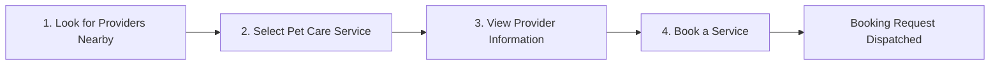
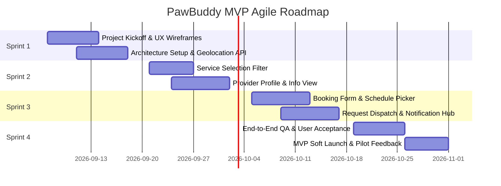

# Project Charter: PawBuddy

**Project Name:** PawBuddy  
**Document Type:** Agile Project Charter  
**Version:** 1.0 (MVP Baseline)  
**Status:** Approved  
**Date:** September 5, 2026  
**Target Milestone:** Minimum Viable Product (MVP) Release  

---

## 1. Executive Summary & Vision

### 1.1 Project Overview
**PawBuddy** is a community-centric pet care platform designed to bridge the gap between pet owners seeking trustworthy, local pet care and qualified independent pet care providers. The Minimum Viable Product (MVP) focuses on delivering an intuitive, frictionless digital experience enabling pet owners to discover nearby providers, explore their services, inspect detailed credentials and pricing, and book pet care appointments quickly.

### 1.2 Vision Statement
> *"To provide every pet parent with immediate access to reliable, caring, and verified local pet care professionals, giving pet owners peace of mind and pets the love and attention they deserve."*

### 1.3 Problem Statement
Finding reliable and accessible pet care on short notice or during travel remains stressful and fragmented:
- **Pet Owners** struggle with word-of-mouth recommendations, lack of price transparency, uncertainty about provider experience, and cumbersome booking arrangements.
- **Pet Care Providers** (sitters, dog walkers, and boarding hosts) lack a streamlined, localized platform to showcase their expertise, set transparent rates, and manage incoming service requests.

### 1.4 Solution
PawBuddy MVP solves these challenges by providing a location-aware web/mobile platform where users can locate nearby pet sitters, walkers, and boarding facilities, compare their services and rates, and dispatch booking requests directly within a single workflow.

---

## 2. Project Objectives & Success Criteria

### 2.1 Strategic Objectives
1. **Accelerate Time-to-Discovery:** Enable pet owners to find qualified nearby pet care within 60 seconds of opening the application.
2. **Increase Transparency:** Provide transparent provider credentials, real pricing, and clear service details to build user confidence.
3. **Streamline Booking:** Deliver a self-service booking request workflow requiring fewer than 4 steps from selection to submission.
4. **Establish Market Traction:** Successfully launch the MVP to validate product-market fit among initial cohorts of pet owners and service providers.

### 2.2 Key Performance Indicators (KPIs) & Success Criteria
| Objective Area | Metric / KPI | MVP Target |
| :--- | :--- | :--- |
| **Discovery** | Search latency for nearby providers | < 1.5 seconds |
| **Engagement** | Profile view rate from search results | > 40% |
| **Conversion** | Booking request completion rate (from provider profile) | > 25% |
| **System Usability** | System Usability Scale (SUS) score from beta testers | ≥ 80 / 100 |
| **Provider Supply** | Active local providers registered across target zones | ≥ 50 verified profiles |
| **Reliability** | Core service uptime during MVP trial | ≥ 99.5% |

---

## 3. Scope Definition & MVP Features

The MVP scope is strictly focused on core value-delivery features to ensure rapid release, rigorous validation, and iterative feedback collection.

### 3.1 In-Scope: Core MVP Features

#### Feature 1: Look for Pet Care Providers Nearby
- **Description:** Users can view available pet care providers operating in their immediate geographic area.
- **Core Functionality:**
  - Device geolocation detection with manual address/zip code entry fallback.
  - Proximity radius filter (e.g., within 5 km, 10 km, 25 km).
  - Dual presentation: Interactive map view with provider pins and responsive list view with provider cards.
  - Quick badges showing provider type (e.g., Dog Walker, In-Home Sitter, Boarding Facility).
- **User Story:**  
  *As a pet owner, I want to see pet sitters, dog walkers, and boarding services around my location so that I can quickly identify care options nearby.*
- **Acceptance Criteria:**
  - System requests location access and displays providers within default 10 km radius.
  - Users can manually input custom city/postal code if GPS is disabled.
  - Distance from user location is visibly badged on each provider card (e.g., "1.2 km away").

#### Feature 2: Select a Pet Care Service
- **Description:** Users can filter and choose the specific category of pet care service required.
- **Core Categories:**
  - **Pet Sitting:** Drop-in visits or in-home day sitting at owner's home.
  - **Dog Walking:** 30-min or 60-min walks around neighborhood/parks.
  - **Pet Boarding:** Overnight or multi-day stays hosted at the provider's residence/facility.
- **Core Functionality:**
  - Prominent service selection toggle/chips on search and browse screens.
  - Multi-select and single-select filtering options.
  - Informational tooltips explaining what each service covers.
- **User Story:**  
  *As a pet owner, I want to choose the service I need (such as pet sitting, dog walking, or pet boarding) so that I only see providers who offer that specific service.*
- **Acceptance Criteria:**
  - Selecting a service category instantly filters provider results.
  - Service indicators highlight provider cards matching selected services.
  - Reset filter option allows returning to "All Services" view.

#### Feature 3: View Provider Information
- **Description:** Users can access a dedicated, comprehensive profile for each provider before deciding to book.
- **Core Profile Elements:**
  - **Experience & Bio:** Years of experience, background, pet types accepted (dogs, cats, small animals), and certifications.
  - **Price Schedule:** Standard hourly, per-walk, or per-night rates with transparent breakdown.
  - **Location & Coverage Area:** Primary location address/zone and active service radius.
  - **Offered Services:** Complete catalogue of services supported with description of deliverables.
  - **Availability Indicator:** Calendar overview showing open vs. booked days.
- **User Story:**  
  *As a pet owner, I want to view the provider's experience, price, location, and available services so that I can evaluate whether they are the right match for my pet.*
- **Acceptance Criteria:**
  - Provider profile displays biography, years of pet care experience, and accepted pet sizes/types.
  - Clear rate card is visible without requiring user registration.
  - Service coverage area is outlined on an interactive map.

#### Feature 4: Book a Service
- **Description:** Users can initiate a booking with their selected provider, specifying timing and requirements.
- **Core Functionality:**
  - Interactive date and time picker for service start and end.
  - Service type selection dropdown tied to provider's listed offerings.
  - Pet details input (pet name, species/breed, special notes/dietary requirements/medication).
  - Booking request dispatch mechanism generating a structured notification to the provider.
  - Confirmation summary and request status tracker (Status: `Pending`, `Accepted`, `Declined`).
- **User Story:**  
  *As a pet owner, I want to choose a provider, select the date and time, and send a booking request so that I can secure pet care for my schedule.*
- **Acceptance Criteria:**
  - Form validates that selected date/time does not conflict with provider's blacked-out availability.
  - Submitting form presents a clear confirmation modal and issues booking ID.
  - Provider receives booking request with pet information and client contact info.
  - User can view submitted requests on a "My Bookings" status page.

---

### 3.2 Out-of-Scope (Deferred to Post-MVP Releases)
The following capabilities are deliberately excluded from the MVP to maintain focus and agility:
- In-app digital payment gateway, escrow, and tipping (parties settle directly for MVP).
- Real-time GPS tracking of dog walks with breadcrumb route logging.
- In-app real-time instant messaging and VoIP calling (initial contact via email/phone link).
- User reviews, star ratings, and community forum moderation.
- Automated pet-sitter algorithm matching (AI recommendations).
- Pet insurance and veterinary verification integrations.
- Multi-pet bulk booking discounts and subscription packages.

---

## 4. Target Audience & Stakeholder Personas

### 4.1 Primary Stakeholders
| Role | Target Persona | Key Needs |
| :--- | :--- | :--- |
| **Pet Owner (Parent)** | Sarah, 32, Working Professional | Needs a dependable walker during office hours and trustworthy weekend boarding with clear pricing. |
| **Pet Care Provider** | Marcus, 26, Certified Dog Trainer / Sitter | Needs local client visibility, flexible scheduling control, and direct booking inquiries. |
| **Platform Product Owner** | Internal Product Team | Needs actionable user feedback on booking conversion and service demand. |

### 4.2 Agile Project Team Roles
- **Product Owner (PO):** Owns product backlog, feature priority, acceptance criteria, and stakeholder alignment.
- **Scrum Master:** Facilitates Agile rituals, removes team blockers, and ensures delivery cadence.
- **UI/UX Designer:** Designs user flows, wireframes, component design systems, and responsive prototypes.
- **Frontend Engineer(s):** Implements client UI, map integration, responsive views, and booking forms.
- **Backend Engineer(s):** Develops RESTful APIs, geolocation queries, database models, and notification services.
- **QA / Test Engineer:** Conducts acceptance testing, integration tests, usability evaluations, and cross-browser testing.

---

## 5. Assumptions, Constraints & Dependencies

### 5.1 Assumptions
1. Users will grant browser/device geolocation permissions or enter accurate postal codes.
2. Initial cohort of pet care providers will be manually vetted and onboarded prior to public MVP release.
3. Pet owners and providers will communicate directly off-platform for payment settlement during the MVP phase.
4. Mobile web responsive interface will provide sufficient reach without requiring native iOS/Android builds initially.

### 5.2 Constraints
1. **Timeframe:** 4 Sprints (8-week duration) from inception to production deployment.
2. **Budget & Infrastructure:** Limited to cost-effective cloud hosting and free-tier map API quotas during beta.
3. **Regulatory:** Terms of service must clarify that PawBuddy acts as an introductory platform and does not employ providers directly.

### 5.3 Dependencies
- **Map & Geocoding API:** OpenStreetMap / Mapbox / Google Maps API for geocoding and proximity calculations.
- **Transactional Notification Engine:** Email/SMS gateway (e.g., SendGrid / Twilio) to deliver booking request alerts.
- **Cloud Infrastructure:** Containerized cloud hosting platform (e.g., AWS, GCP, or Vercel/Node.js stack).

---

## 6. High-Level Agile Roadmap & Sprint Breakdown

The project follows a 2-week sprint cycle across an 8-week MVP delivery window:

| Sprint | Timeline | Primary Objectives | Deliverables |
| :--- | :--- | :--- | :--- |
| **Sprint 1** | Week 1 - 2 | Project setup, UX design, Geolocation baseline | Database schema, map SDK integration, Nearby Provider search API |
| **Sprint 2** | Week 3 - 4 | Service categorization & Provider details | Service selection pills, full Provider Profile pages, rate cards |
| **Sprint 3** | Week 5 - 6 | Booking engine & Notifications | Booking modal, date/time availability check, email alert dispatch |
| **Sprint 4** | Week 7 - 8 | Hardening, testing, UAT, and rollout | Cross-device testing, bug triage, production deployment, pilot launch |

---

## 7. Risk Management & Mitigation

| Risk ID | Identified Risk | Impact | Probability | Mitigation Strategy |
| :---: | :--- | :---: | :---: | :--- |
| **R-01** | Low provider density in specific geographic regions | High | High | Focus MVP launch on a single concentrated metropolitan area before expanding. |
| **R-02** | Geolocation permission denied by browser | Medium | Medium | Implement intuitive fallback to manual zip/postal code or city text input. |
| **R-03** | Provider delays in responding to booking requests | High | Medium | Introduce automated reminder notifications and display response rate on profiles. |
| **R-04** | Service scope creep during development | Medium | High | Enforce strict Definition of Done (DoD); park all non-MVP features in Product Backlog. |
| **R-05** | Map API rate limit / cost spikes | Medium | Low | Implement server-side caching of coordinates and optimize bounding-box queries. |

---

## 8. Definition of Ready (DoR) & Definition of Done (DoD)

### 8.1 Definition of Ready (DoR)
A user story is ready for sprint backlog inclusion when:
- Story is written in standard format (*As a... I want to... So that...*).
- Acceptance criteria are explicitly documented and testable.
- UI wireframes/mockups are attached and reviewed.
- External dependencies and API requirements are identified.
- Story has been estimated by the engineering team during backlog refinement.

### 8.2 Definition of Done (DoD)
A user story is considered Done and releasable when:
- Code is peer-reviewed and merged into the main branch.
- Unit and integration tests pass with ≥ 85% code coverage for core business logic.
- UI meets accessibility standards (contrast, screen reader friendly) and mobile responsiveness.
- Feature satisfies all listed Acceptance Criteria in a staging environment.
- Documentation (API endpoints, component guide) is updated.
- Product Owner conducts UAT and signs off on the functionality.

---

## 9. Project Governance & Communication Plan

| Event / Channel | Frequency | Participants | Objective |
| :--- | :--- | :--- | :--- |
| **Daily Standup** | Daily (15 mins) | Dev Team, Scrum Master, PO | Synchronize daily work, highlight blockers |
| **Sprint Planning** | Bi-weekly (1st Monday) | Full Scrum Team | Commit to sprint backlog items from priority |
| **Sprint Review / Demo** | Bi-weekly (2nd Friday) | Scrum Team, Stakeholders | Demonstrate working increment, gather feedback |
| **Sprint Retrospective** | Bi-weekly (2nd Friday) | Full Scrum Team | Continuous process improvement |
| **Backlog Refinement** | Mid-sprint (weekly) | PO, Tech Lead, Team | Clarify stories, groom backlog for future sprints |

---

## 10. Approval & Sign-Off

By signing below, the project stakeholders endorse the project charter, agree to the stated MVP scope, and authorize the Agile team to proceed with implementation.

| Role | Name | Title | Date | Signature |
| :--- | :--- | :--- | :--- | :--- |
| **Product Owner** | ____________________ | Head of Product | ____________ | [ Pending ] |
| **Scrum Master** | ____________________ | Agile Coach / SM | ____________ | [ Pending ] |
| **Technical Lead** | ____________________ | Lead Architect | ____________ | [ Pending ] |
| **Executive Sponsor** | ____________________ | VP of Engineering | ____________ | [ Pending ] |
